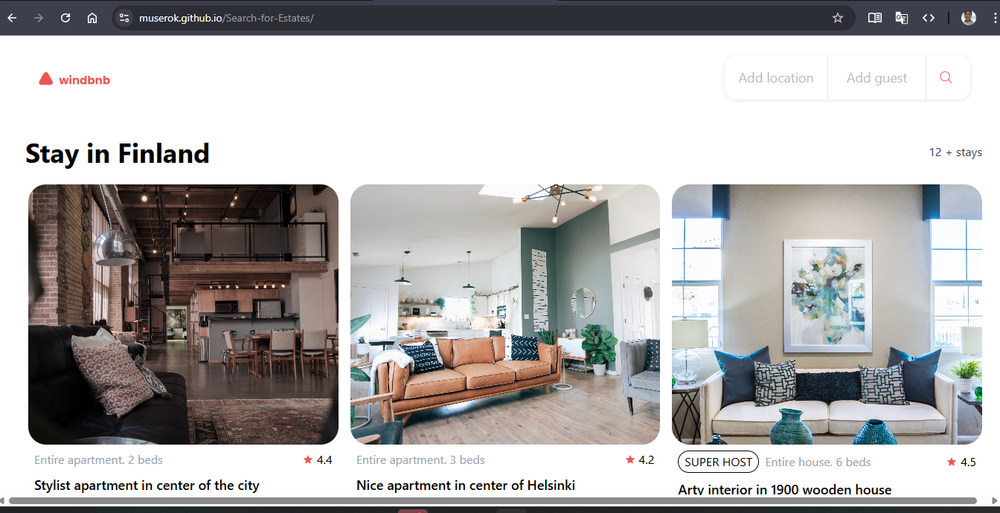
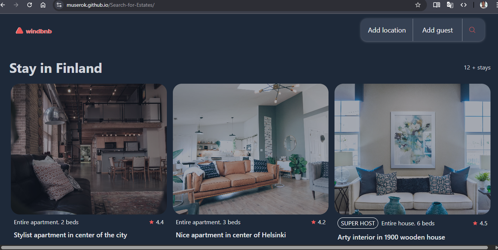
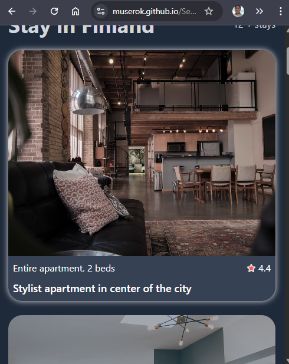
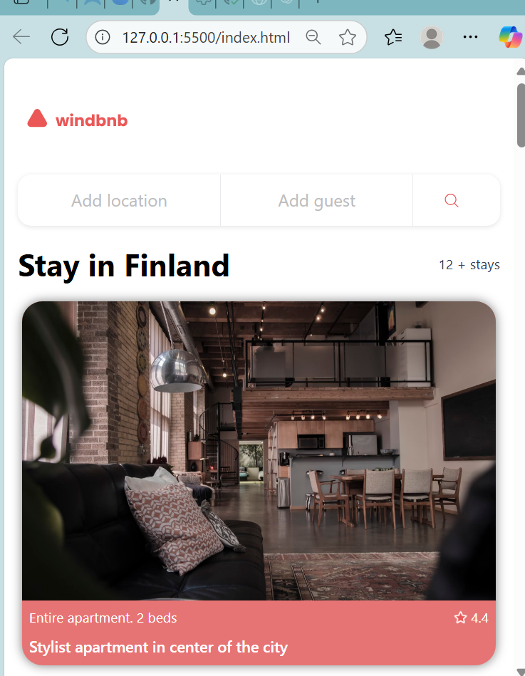
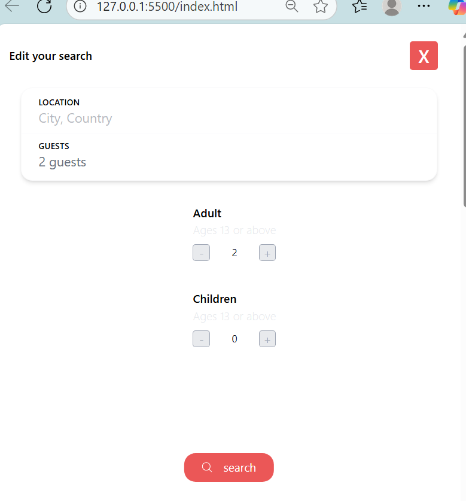
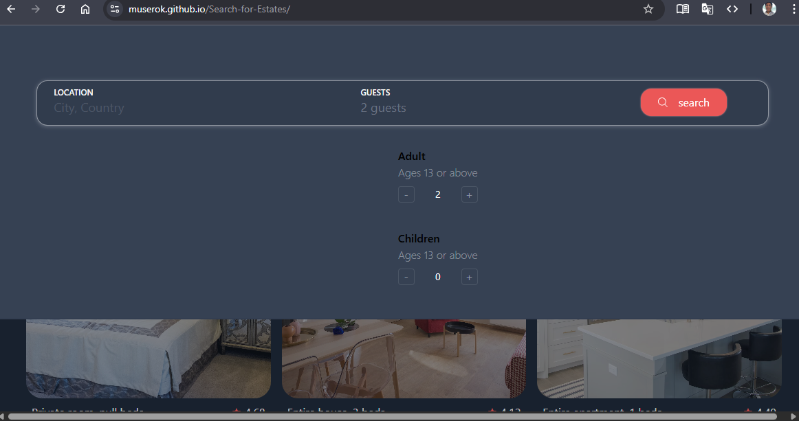

Bienvenido a mi Proyecto! 

Gracias desde ya por tu visita.

---EXTRAS--

DarkMode: a fin de respetar el diseño original, agregué la funcionalidad de activacion directamente a la configuracion del usuario en su sistema.
     1- 
     2- 

Estilos:

     1- cards:hover, active, sombras, redondeos de bordes en imagen, background, colores de fuentes, animacion en rating. 
               - tambien hay estilos adaptados al darkmode.
     2- body: en modo dark

     3- logo: en modo dark

     4- opcion filtrado: hover, sombras modo dark

     5- modalFiltros
          - boton cerrar: background
          - darkmode: background, texto cerrar, boton search, titulo accion.

Capturas:

